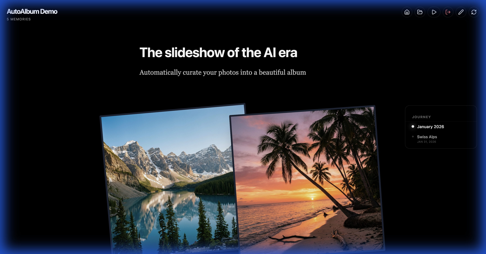

# 📸 AutoAlbum

**Your memories, beautifully organized. Zero cloud. Zero installation. Purely local.**

AutoAlbum is a local-first photo journal and gallery. It scans your photo directory, extracts metadata (GPS, timestamps, EXIF), and automatically generates a stunning, interactive timeline with location-aware headers, intelligent image clustering, and rich journaling blocks.

## 🖼️ Preview


*Automatic clustering and timeline generation.*


*Dynamic layout controls: Adjust density, size, and rotation on the fly.*


---

## ✨ Key Features

- **🚀 Instant Portability**: No installation required. Runs as a standalone executable on Mac and Windows.
- **🔒 Privacy First**: All photo processing and metadata storage happen 100% on your machine. Your personal data never touches the cloud.
- **🎨 Dynamic Aesthetics**: 
  - **Density Control**: Adjust image grouping and vertical rhythm in real-time.
  - **Chaos (Rotation)**: Toggle a "physical photo" aesthetic with randomized rotations.
  - **Image Scaling**: Globally scale images to fit your screen and preference.
- **📍 Smart Narrative**: 
  - **Location Enrichment**: Automatically converts GPS coordinates into human-readable city/town names.
  - **Map Transitions**: Visualizes travel between distant locations with animated paths.
  - **Journaling**: Add Markdown-powered text blocks anywhere to narrate your journey.
- **⚙️ Configurable**: All settings and narrative data are stored in a single `AutoAlbum.json` file inside your photos directory.

---

## 🚀 Getting Started

### 📦 Standalone (No Install)
1. **Download** the latest release for your OS.
2. **Launch**:
   - **MacOS**: Double-click the `auto-album` binary.
   - **Windows**: Run the `auto-album.exe`.
3. **Select Folder**: Point the app at any directory containing photos.
4. **Enjoy**: The app explores your photos and opens a browser window to `http://localhost:3002` automatically.

### 🛠️ Developer Setup
If you want to contribute or build from source:
1. **Prerequisites**: [Node.js](https://nodejs.org/) (v18+)
2. **Install**: `npm install`
3. **Build & Run**:
   ```bash
   npm run dev
   ```
4. **Build Binaries**:
   ```bash
   npm run package:cli
   ```

---

## 🛠️ Architecture & Stack

### The `AutoAlbum.json` Manifest
AutoAlbum follows a "data-adjacent" storage philosophy. Everything is kept within the folder you select, making your albums fully portable.
- **JSON Manifest**: Tracks metadata, captions, manual overrides, and configuration.
- **Non-Destructive**: Your original photos are never modified.

### Tech Stack
- **Frontend**: React 19, Vite, Tailwind CSS, Framer Motion, TanStack Virtual.
- **Backend**: Node.js, Express 5.
- **Libraries**: ExifReader, ColorThief, Geolib, Lenis (Smooth Scroll).

---

## ⚠️ Limitations & Good to Know

- **Supported Formats**: `.jpg`, `.jpeg`, `.png`, and `.webp`. *(HEIC/HEIF is currently not supported).*
- **Write Permissions**: The app must be able to write `AutoAlbum.json` to your target directory.
- **Offline Geocoding**: Automatically converts GPS coordinates into human-readable city/town names using a local database. No internet required after the initial setup.

---

## 🤝 Contributing
Feel free to open issues or pull requests. Let's make photo viewing beautiful again!

#AI #ProductManagement #RapidPrototyping #LocalFirst #BuildInPublic
